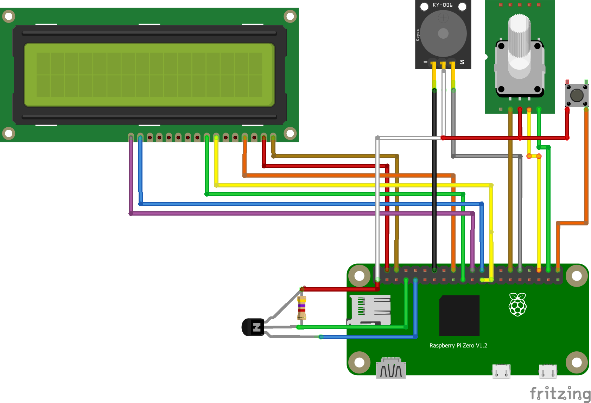

# CraftBeerPi

## Installation CraftBeerPi 3
How to install CraftBeerPi: https://github.com/Manuel83/craftbeerpi3

1. Login to RaspberryPi (User:pi / PW:raspberry)
2. Update RaspberryPi with `~$ sudo apt update`
3. Upgrade RaspberryPi with `~$ sudo apt upgrade`
4. Install Git with `~$ sudo apt install git`
5. Download CraftBeerPi `~$ git clone https://github.com/manuel83/craftbeerpi3`
6. Change directory to `craftbeerpi` with `~$ cd craftbeerpi3`
7. Install CraftBeerPi `~/craftbeerpi $ sudo ./install.sh`
8. Check status: `~craftbeerpi3 $ sudo /etc/init.d/craftbeerpiboot status`
9. Start Service: `~craftbeerpi3 $ sudo /etc/init.d/craftbeerpiboot start`
10. Check if IP-address is allocated `~craftbeerpi3 $ netstat -plnt`
11. Run: `~craftbeerpi3 $ sudo ./run.py` and look at error `ImportError: No module named flask`
12. First install: `~craftbeerpi3 $ sudo apt-get install python-pip -y`
13. Install: `~craftbeerpi3 $ sudo pip install flask`
14. Install: `~craftbeerpi3 $ sudo pip install flask_socketio`
15. Install: `~craftbeerpi3 $ sudo pip install flask_classy`
16. Install: `~craftbeerpi3 $ sudo pip install PyYAML`
17. Install: `~craftbeerpi3 $ sudo pip install GitPython`
18. Install: `~craftbeerpi3 $ sudo pip install requests`
19. Install: `~craftbeerpi3 $ sudo pip install gitdb2==2.0.5`
20. Run: `~craftbeerpi3 $ sudo ./run.py` --> look at: INIT DB --> success!! 
21. Check if IP-address is allocated `~craftbeerpi3 $ netstat -plnt`
22. Open Browser with url `http://<ip>:5000`

### Zusätzliche Info's

https://techdout.dev/2019/09/24/installing-craftbeerpi/

## Installation CraftBeerPi 4
How to install CraftBeerPi 4: https://craftbeerpi.gitbook.io/craftbeerpi4/

1. Login to RaspberryPi (User:pi / PW:raspberry)
2. Update RaspberryPi with: `~$ sudo apt update`
3. Upgrade RaspberryPi with: `~$ sudo apt upgrade`
4. Install PIP with: `~$ sudo apt install python3-pip `
5. Install PIP with: `~$ sudo pip3 install cbpi`
6. Download CraftBeerPi: `~$ sudo pip3 install https://github.com/Manuel83/craftbeerpi4/archive/master.zip`
7. Download CraftBeerPi `~$ sudo pip3 install https://github.com/Manuel83/craftbeerpi4/archive/master.zip`

### Verkabelung

